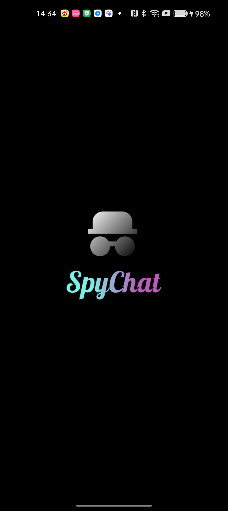
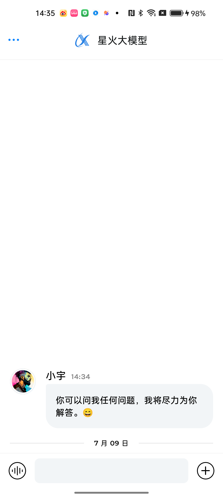
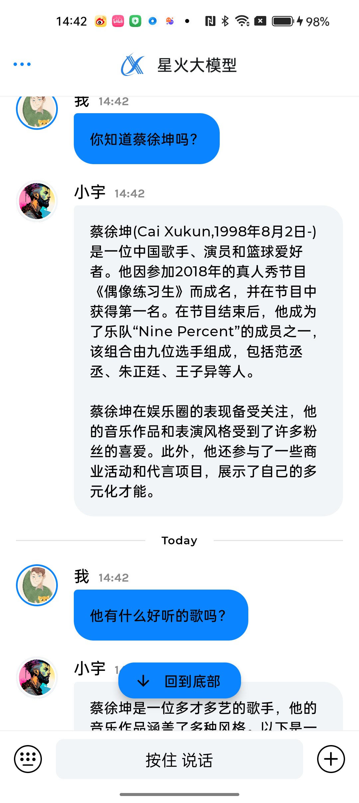
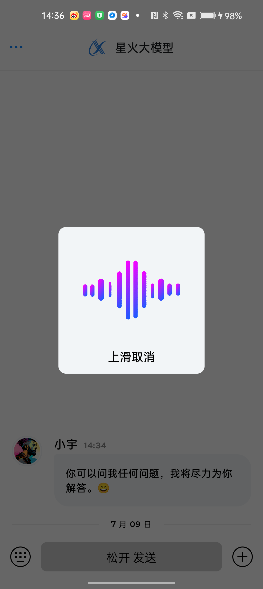
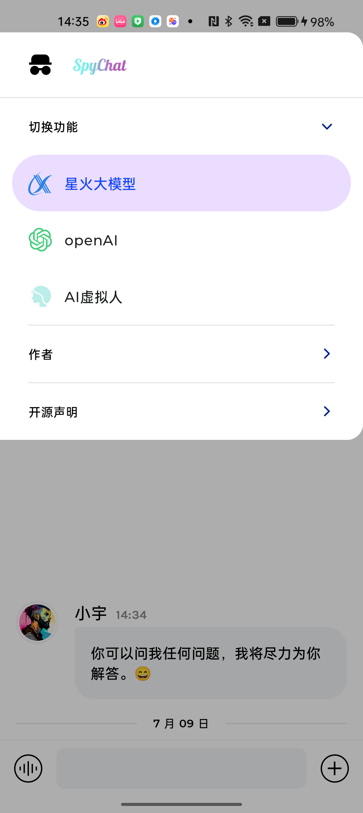
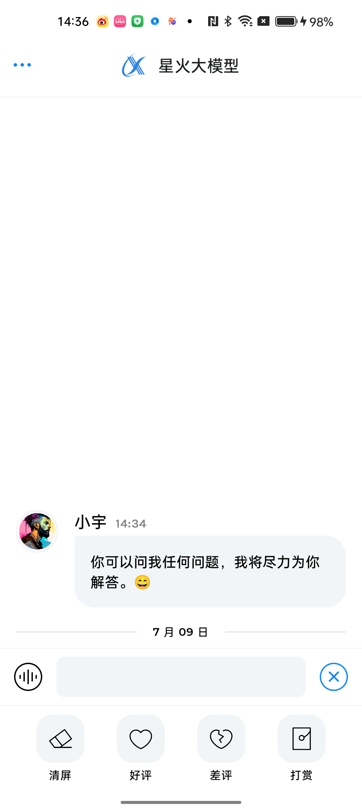

# SpyChat

SpyChat is a large language model chat app built with [Jetpack Compose][compose]. 
Key Words: LLM, Splash Screen, Speech Recognizer, OpenAi.

To try out this app, use the latest stable version
of [Android Studio](https://developer.android.com/studio).

This app showcases:

* Thy Way to use LLM sdk.
* Speech Recognizer by XunFei.
* UI state management
* Integration with Architecture Components: Navigation, Fragments, ViewModel
* Back button handling
* Text Input and focus management
* Multiple types of animations and transitions
* Saved state across configuration changes
* Material Design 3 theming and Material You dynamic color
* Compose animation
* Splash screen

### Status: 🚧 In progress

SpyChat is still in under development, and some features are not yet implemented. I will continue to maintain this project

## Screenshots
* Splash Screen


* Main Screen


* Test


* Speech


* Options


* Buttons


## Known issues
* You have to apply for appid、apiSecret、apiKey at the [xun fei open platform][xfyun], and put them into **local.properties**
* example:
    appId="123456"
    apiSecret="abcdefghijkopqrstuvwxyz"
    apiKey="abcdefghijkopqrstuvwxyz"
* You need allow RECORD_AUDIO permission in settings, since the runtime permission feature have not done.

## Base sample
* This Project is base on Google official chat demo [JetChat](https://github.com/android/compose-samples/tree/main/Jetchat)

## License
```
Copyright 2020 The Android Open Source Project

Licensed under the Apache License, Version 2.0 (the "License");
you may not use this file except in compliance with the License.
You may obtain a copy of the License at

    https://www.apache.org/licenses/LICENSE-2.0

Unless required by applicable law or agreed to in writing, software
distributed under the License is distributed on an "AS IS" BASIS,
WITHOUT WARRANTIES OR CONDITIONS OF ANY KIND, either express or implied.
See the License for the specific language governing permissions and
limitations under the License.
```

[compose]: https://developer.android.com/jetpack/compose
[coil-accompanist]: https://google.github.io/accompanist/coil/
[xfyun]: https://passport.xfyun.cn/register
